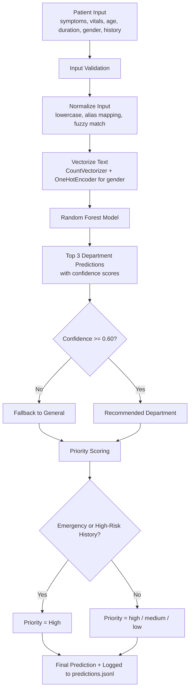
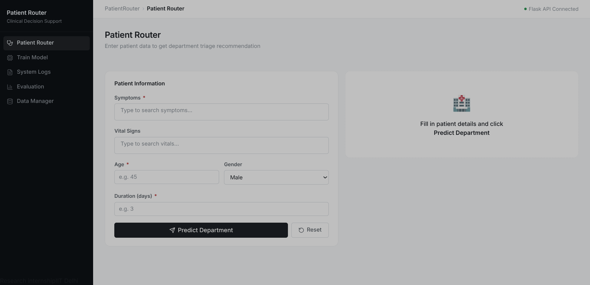
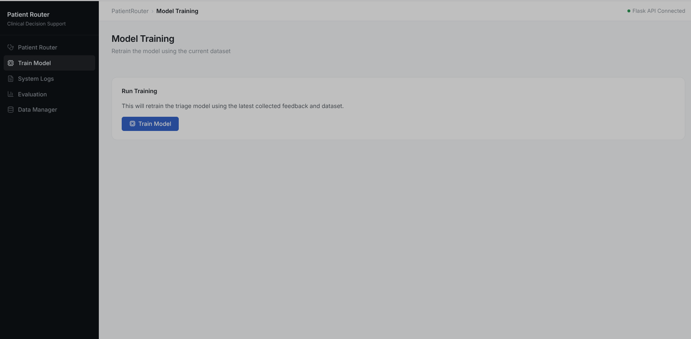
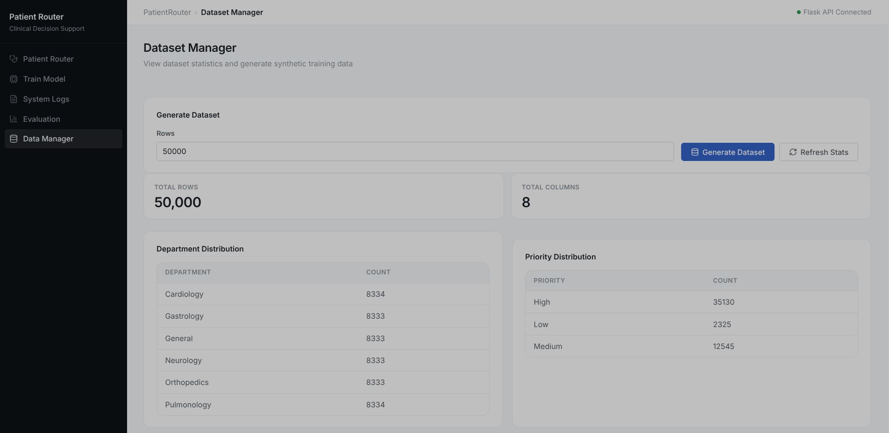
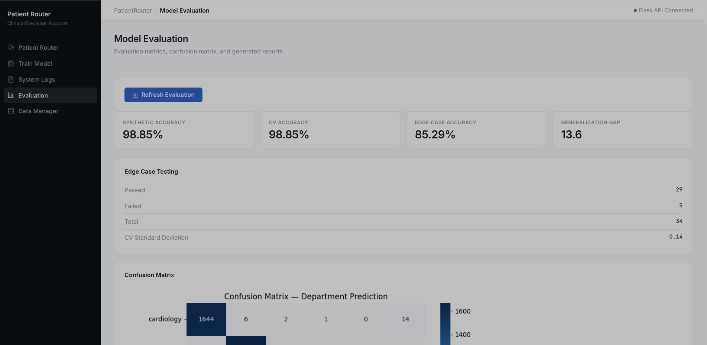
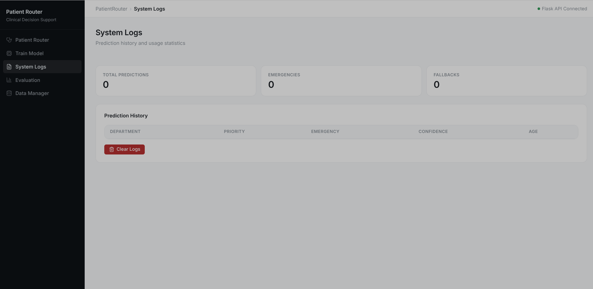

<p align="center">
  
</p>

<h1 align="center">Patient Router</h1>

<p align="center">
  <a href="https://github.com/AyusmanNanda/patient-router/actions/workflows/backend-ci.yml">
    
  </a>
  <a href="https://github.com/AyusmanNanda/patient-router/actions/workflows/frontend-ci.yml">
    
  </a>
  <a href="https://patient-router.vercel.app">
    
  </a>
  
  
  
  
  
  <a href="LICENSE">
    
  </a>
</p>

<p align="center">
  <b><a href="https://patient-router.vercel.app">Live Demo →</a></b>
</p>

> ML-based hospital triage routing system that automatically assigns patients to the most appropriate department based on symptoms, vitals, age, gender, duration, and medical history — with a full React dashboard for prediction, feedback, retraining, and monitoring.

---

## Overview

In hospital emergency departments, patients are often routed to the wrong department initially — wasting critical time. Patient Router automates this initial triage decision using a Random Forest classifier trained on structured patient data, combined with a rule-based priority and emergency-detection layer, and a feedback loop that feeds corrections straight back into the training set.

The project has three parts:

| Part | Location | Responsibility |
|---|---|---|
| ML core | `backend/ml/` | Synthetic data generation, training, evaluation, inference |
| Flask API | `backend/app.py`, `routes/`, `services/` | Exposes the ML pipeline over HTTP |
| React dashboard | `frontend/` | Patient intake form, feedback collection, dataset manager, training runner, evaluation viewer, logs |

For the full pipeline, scoring logic, and normalization rules, see **[docs/architecture.md](docs/architecture.md)**.
For full request/response examples, see **[docs/api.md](docs/api.md)**.

---

## System Flow



*Full breakdown of each stage — the ML pipeline, priority scoring, emergency detection, and input normalization — lives in [docs/architecture.md](docs/architecture.md).*

---

## Screenshots

<details>
<summary>Click to expand</summary>

| Patient Router | Train Model |
|---|---|
|  |  |

| Data Manager | Evaluation |
|---|---|
|  |  |

| System Logs |
|---|
|  |

</details>

---

## API

Full request/response examples: **[docs/api.md](docs/api.md)**

### Core
| Method | Route | Description |
|---|---|---|
| `GET` | `/` | Service info |
| `GET` | `/health` | Health check |

### Prediction & Feedback
| Method | Route | Description |
|---|---|---|
| `POST` | `/predict` | Run triage prediction |
| `POST` | `/feedback` | Submit correction, appended to `data.csv` |

### Dataset
| Method | Route | Description |
|---|---|---|
| `GET` | `/data` | Dataset stats (row/column counts, department & priority distribution) |
| `POST` | `/data/generate` | Regenerate synthetic dataset (`{ "rows": 50000 }`) |

### Training & Evaluation
| Method | Route | Description |
|---|---|---|
| `POST` | `/train` | Retrain the model on current `data.csv` |
| `GET` | `/evaluation` | Evaluation metrics JSON |
| `GET` | `/evaluation/confusion-matrix` | Confusion matrix image |
| `GET` | `/evaluation/report-image` | Evaluation report image |

### Logs
| Method | Route | Description |
|---|---|---|
| `GET` | `/logs` | Prediction history + emergency/fallback counts |
| `POST` | `/logs/clear` | Clear prediction log |

---

## Running Locally

### Backend

```bash
cd backend
python -m venv venv
source venv/bin/activate
pip install -r requirements.txt

# generate dataset
python -m ml.generate_data

# train model + run evaluation
python -m ml.train

# start API
python app.py
```

### Frontend

```bash
cd frontend
npm install
echo "VITE_BACKEND=http://localhost:5000" > .env
npm run dev
```

---

## Limitations

- Trained on synthetic data — real-world accuracy would be lower and would need clinical validation
- Small vocabulary of 20 symptoms, 7 vitals, and 6 history conditions
- CountVectorizer treats multi-word symptoms as separate tokens
- Only 6 departments — real hospitals have many more, with finer sub-specialties
- The synthetic data labeling logic (`generate_data.py`) and the live priority logic (`priority.py`) aren't perfectly aligned, which can introduce label/inference drift
- Feedback corrections are written straight into the training CSV with minimal validation — bad input could degrade future retraining
- No authentication on training/data-regeneration endpoints

---

## Tech Stack

**Backend:** Python, Flask, scikit-learn, pandas, numpy, joblib
**Frontend:** React, TypeScript, Vite, lucide-react
**ML:** RandomForestClassifier, CountVectorizer, OneHotEncoder

---

## Project Structure

<details>
<summary>Click to expand</summary>

```
patient-router/
├── backend/
│   ├── app.py                      # Flask app entrypoint
│   ├── requirements.txt
│   ├── routes/
│   │   ├── homeRoute.py
│   │   ├── healthRoute.py
│   │   ├── predictRoute.py
│   │   ├── feedbackRoute.py
│   │   ├── dataRoute.py
│   │   ├── trainRoute.py
│   │   ├── evaluationRoute.py
│   │   └── logRoute.py
│   ├── services/
│   │   ├── predictService.py
│   │   ├── feedbackService.py
│   │   ├── dataService.py
│   │   ├── trainService.py
│   │   ├── evalutationService.py
│   │   └── logService.py
│   ├── ml/
│   │   ├── constants.py            # symptom/vital weights, departments, aliases
│   │   ├── generate_data.py        # synthetic dataset generation
│   │   ├── train.py                # model training
│   │   ├── model_evaluation.py     # accuracy, CV, confusion matrix
│   │   ├── prediction/
│   │   │   ├── predict.py          # inference entrypoint (predict_case)
│   │   │   ├── priority.py         # priority scoring
│   │   │   ├── emergency.py        # emergency detection
│   │   │   └── history.py          # medical history risk scoring
│   │   └── models/
│   │       └── model.pkl
│   ├── data/
│   │   └── data.csv                # synthetic + feedback training data
│   ├── logs/
│   │   ├── predictions.jsonl
│   │   └── triage.log
│   └── reports/
│       ├── evaluation_metrics.json
│       ├── evaluation_report.txt
│       ├── confusion_matrix.png
│       └── evaluation_report.png
├── frontend/
│   ├── index.html
│   ├── package.json
│   ├── vite.config.ts
│   ├── vercel.json
│   ├── public/
│   │   ├── favicon.svg
│   │   └── icons.svg
│   └── src/
│       ├── App.tsx
│       ├── main.tsx
│       ├── api/
│       │   └── api.ts
│       ├── components/
│       │   ├── layout/
│       │   │   ├── Sidebar.tsx
│       │   │   ├── Topbar.tsx
│       │   │   └── TagInput.tsx
│       │   └── patient-router/
│       │       └── patientForm.tsx
│       ├── pages/
│       │   ├── PatientRouter.tsx   # intake form + prediction + feedback
│       │   ├── DataManger.tsx      # dataset stats + generation
│       │   ├── Training.tsx        # trigger retraining, view accuracy
│       │   ├── Evaluation.tsx      # metrics, confusion matrix, report
│       │   └── Logs.tsx            # prediction history + stats
│       ├── hooks/
│       │   ├── usePatientRouter.ts
│       │   ├── useDataManager.ts
│       │   ├── useTraining.ts
│       │   ├── useEvaluation.ts
│       │   └── useLogs.ts
│       ├── types/
│       │   ├── prediction.ts
│       │   ├── dataTypes.ts
│       │   ├── trainingTypes.ts
│       │   ├── evaluationType.ts
│       │   ├── logsTypes.ts
│       │   └── patientFromTypes.ts
│       └── constants/
│           └── patientOptions.ts   # symptom/vital/history/department options
├── docs/
│   ├── api.md
│   ├── architecture.md
│   └── assets/screenshots/
├── LICENSE
└── README.md
```

</details>