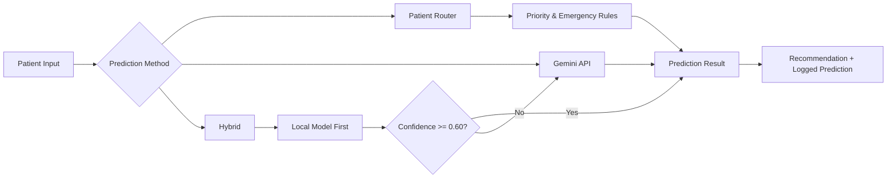

<p align="center">
  
</p>

<h1 align="center">Patient Router</h1>

<p align="center">
  <a href="https://github.com/AyusmanNanda/patient-router/actions/workflows/backend-ci.yml">
    
  </a>
  <a href="https://github.com/AyusmanNanda/patient-router/actions/workflows/frontend-ci.yml">
    
  </a>
  <a href="https://patient-router.vercel.app">
    
  </a>
  
  
  
  
  
  <a href="LICENSE">
    
  </a>
</p>

<p align="center">
  <b><a href="https://patient-router.vercel.app">Live Demo →</a></b>
</p>

> This is a student research prototype, not a validated clinical tool. It has not been tested on real patients, so please don't use it to make actual triage decisions.

---

## Overview

In hospital emergency departments, patients are often sent to the wrong department at first, and that wastes time that matters. For this project I tried to see if a simple ML model could help with that first triage step: a Gradient Boosting classifier trained on structured patient data, plus some rule-based logic on top for priority and emergency cases, and a feedback loop so corrections go back into the training data.

I also added Gemini API and Hybrid prediction methods to experiment with other approaches while keeping the locally trained model as the main part of the project.

The local model is trained only on synthetic data I generated myself, so please treat the predictions as a proof of concept, not something clinically reliable.

Patient Router is available as a web application and as an Electron desktop application for Windows and Linux.

The project has three parts:

| Part            | Location                                 | Responsibility                                                                                      |
| --------------- | ---------------------------------------- | --------------------------------------------------------------------------------------------------- |
| ML core         | `backend/ml/`                            | Synthetic data generation, model comparison, training, evaluation, inference                        |
| Flask API       | `backend/app.py`, `routes/`, `services/` | Exposes the prediction pipeline and other backend functionality over HTTP                           |
| React dashboard | `frontend/`                              | Patient intake, prediction, feedback collection, dataset management, training, evaluation, and logs |

For the full pipeline, API contract, environment setup, and everything else, see the documentation below.

---

## Documentation

| Doc                                          | Covers                                                                                                                                       |
| -------------------------------------------- | -------------------------------------------------------------------------------------------------------------------------------------------- |
| [docs/architecture.md](docs/architecture.md) | ML pipeline, the three prediction methods, priority scoring, emergency detection, normalization, evaluation, model comparison, feedback loop |
| [docs/api.md](docs/api.md)                   | Full request/response examples for every route                                                                                               |
| [docs/setup.md](docs/setup.md)               | Environment variables, local setup, troubleshooting                                                                                          |
| [docs/frontend.md](docs/frontend.md)         | React dashboard structure: pages, hooks, shared components                                                                                   |
| [docs/data-schema.md](docs/data-schema.md)   | Symptom/vital/history vocabulary and weight tables                                                                                           |
| [docs/deployment.md](docs/deployment.md)     | Vercel frontend, backend hosting requirements, desktop builds                                                                                |

---

## System Flow



For the full breakdown of each stage, see [docs/architecture.md](docs/architecture.md).

---

## Screenshots

<details>
<summary>Click to expand</summary>

| Patient Router                                      | Train Model                                       |
| --------------------------------------------------- | ------------------------------------------------- |
|  |  |

| Data Manager                                             | Evaluation                                            |
| -------------------------------------------------------- | ----------------------------------------------------- |
|  |  |

| System Logs                                      |
| ------------------------------------------------ |
|  |

</details>

---

## API

Patient Router exposes REST API endpoints for prediction, feedback, dataset management, model training, evaluation, model comparison, and logs.

For the complete API reference with request and response examples, see [docs/api.md](docs/api.md).

---

## Running Locally

```bash
# backend
cd backend
python -m venv venv
source venv/bin/activate
pip install -r requirements.txt
cp .env.example .env
python -m ml.generate_data
python -m ml.train
python app.py

# frontend
cd frontend
npm install
cp .env.example .env
npm run dev
```

For environment variables, config, and troubleshooting, see [docs/setup.md](docs/setup.md).

---

## Limitations

* The local model is trained on synthetic data I generated, not real patient records, so I can't say how it would actually perform in a hospital
* Only 6 departments, 20 symptoms, 7 vitals, and 6 history conditions: this was a scope decision to keep the project manageable, not something I ran out of time to add

---

## Tech Stack

**Backend:** Python, Flask, scikit-learn, pandas, numpy, joblib
**Frontend:** React, TypeScript, Vite, lucide-react
**Desktop:** Electron, electron-builder
**ML:** GradientBoostingClassifier, CountVectorizer, OneHotEncoder
**External API:** Gemini 2.5 Flash
