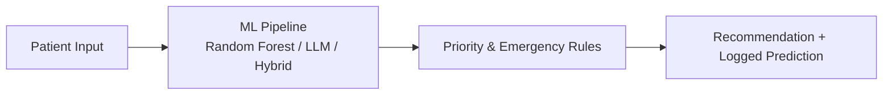

<p align="center">
  
</p>

<h1 align="center">Patient Router</h1>

<p align="center">
  <a href="https://github.com/AyusmanNanda/patient-router/actions/workflows/backend-ci.yml">
    
  </a>
  <a href="https://github.com/AyusmanNanda/patient-router/actions/workflows/frontend-ci.yml">
    
  </a>
  <a href="https://patient-router.vercel.app">
    
  </a>
  
  
  
  
  
  <a href="LICENSE">
    
  </a>
</p>

<p align="center">
  <b><a href="https://patient-router.vercel.app">Live Demo →</a></b>
</p>

> ML-based hospital triage routing system that automatically assigns patients to the most appropriate department based on symptoms, vitals, age, gender, duration, and medical history — with a full React dashboard for prediction, feedback, retraining, and monitoring.

---

## Overview

In hospital emergency departments, patients are often routed to the wrong department initially, wasting critical time. Patient Router automates this initial triage decision using a Random Forest classifier trained on structured patient data, combined with a rule-based priority and emergency-detection layer, and a feedback loop that feeds corrections back into the training set.

The project has three parts:

| Part | Location | Responsibility |
|---|---|---|
| ML core | `backend/ml/` | Synthetic data generation, training, evaluation, inference |
| Flask API | `backend/app.py`, `routes/`, `services/` | Exposes the ML pipeline over HTTP |
| React dashboard | `frontend/` | Patient intake form, feedback collection, dataset manager, training runner, evaluation viewer, logs |

For the full pipeline, API contract, environment setup, and everything else, see the table below.

---

## Documentation

| Doc | Covers |
|---|---|
| [docs/architecture.md](docs/architecture.md) | ML pipeline, the three prediction methods, priority scoring, emergency detection, normalization, evaluation, feedback loop |
| [docs/api.md](docs/api.md) | Full request/response examples for every route |
| [docs/setup.md](docs/setup.md) | Environment variables, local setup, troubleshooting |
| [docs/frontend.md](docs/frontend.md) | React dashboard structure — pages, hooks, shared components |
| [docs/data-schema.md](docs/data-schema.md) | Symptom/vital/history vocabulary and weight tables |
| [docs/deployment.md](docs/deployment.md) | Vercel frontend, backend hosting requirements, desktop builds |

---

## System Flow



Full breakdown of each stage — normalization, the three prediction methods, priority scoring, and emergency detection — lives in `docs/architecture.md`.

---

## Screenshots

<details>
<summary>Click to expand</summary>

| Patient Router | Train Model |
|---|---|
|  |  |

| Data Manager | Evaluation |
|---|---|
|  |  |

| System Logs |
|---|
|  |

</details>

---

## API

**Core:** `GET /`, `GET /health`
**Prediction & Feedback:** `POST /predict`, `POST /feedback`
**Dataset:** `GET /data`, `POST /data/generate`
**Training & Evaluation:** `POST /train`, `GET /evaluation`, `GET /evaluation/confusion-matrix`, `GET /evaluation/report-image`
**Logs:** `GET /logs`, `POST /logs/clear`

Full request/response examples for every route: `docs/api.md`

---

## Running Locally

```bash
# backend
cd backend && python -m venv venv && source venv/bin/activate
pip install -r requirements.txt
python -m ml.generate_data && python -m ml.train
python app.py

# frontend
cd frontend && npm install
echo "VITE_BACKEND=http://localhost:5000" > .env && npm run dev
```

Environment variables, config, and troubleshooting: `docs/setup.md`

---

## Limitations

- Trained on synthetic data — real-world accuracy would be lower and would need clinical validation
- Only 6 departments, 20 symptoms, 7 vitals, and 6 history conditions — a scope decision baked into the synthetic data design, not a bug

---

## Tech Stack

**Backend:** Python, Flask, scikit-learn, pandas, numpy, joblib
**Frontend:** React, TypeScript, Vite, lucide-react
**ML:** RandomForestClassifier, CountVectorizer, OneHotEncoder