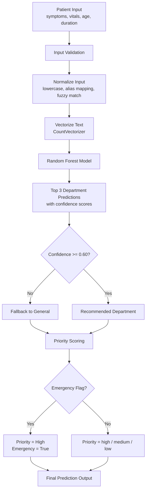
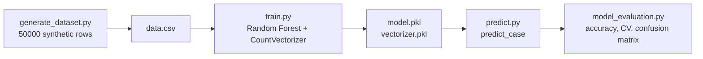
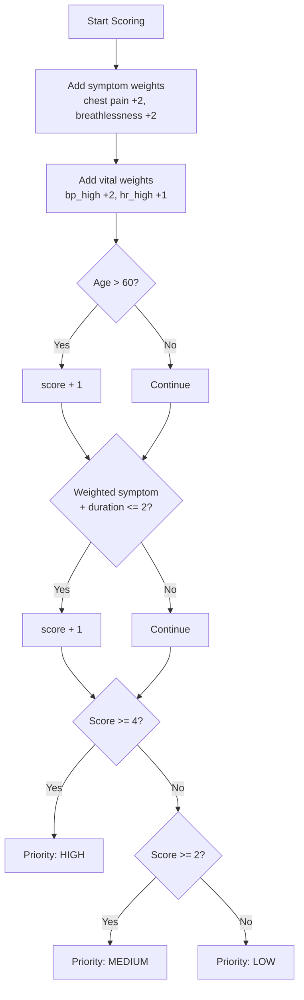
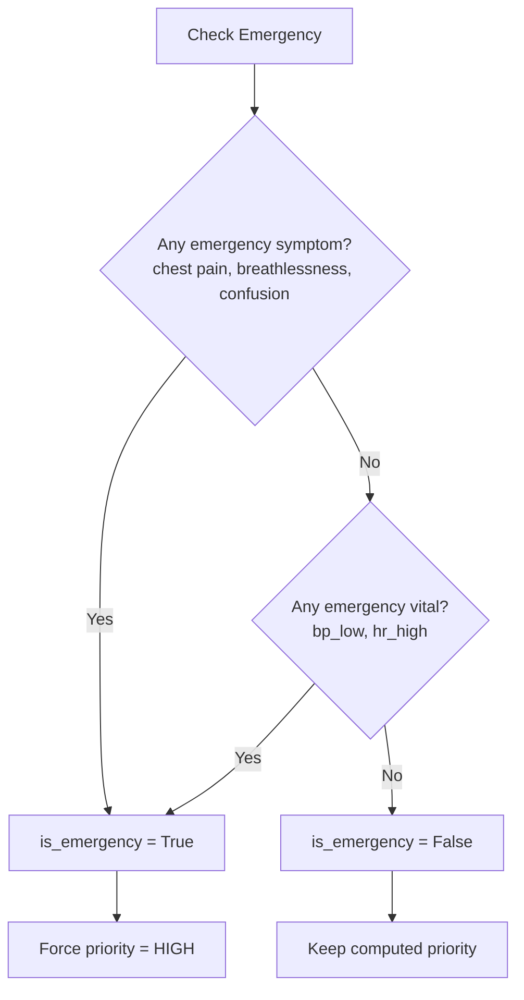
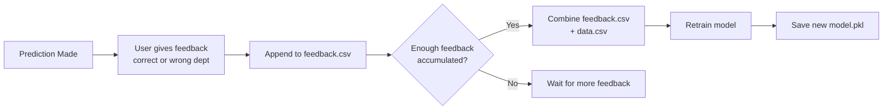

# Patient Router
> ML-based hospital triage routing system that automatically assigns patients to the most appropriate department based on symptoms, vitals, age, and duration of illness.

---

## Overview

In hospital emergency departments, patients are often routed to the wrong department initially — wasting critical time. Patient Router automates this initial triage decision using a Random Forest classifier trained on structured patient data, combined with a rule-based priority and emergency detection layer on top.

---

## System Flow



---

## ML Pipeline



---

## Priority Scoring Logic



---

## Emergency Detection



---

## Input Normalization Flow

```mermaid
flowchart TD
    A[Raw user input] --> B[Lowercase + strip]
    B --> C{In alias map?}
    C -- Yes --> D[Map to correct term\ne.g. shortness of breath → breathlessness]
    C -- No --> E{Exact match in\nknown terms?}
    E -- Yes --> F[Use as-is]
    E -- No --> G{Space/underscore swap\nmatches known term?}
    G -- Yes --> H[Use swapped term\ne.g. bp high → bp_high]
    G -- No --> I{Fuzzy match\ncutoff 0.75?}
    I -- Yes --> J[Use closest match\ne.g. breathlessnes → breathlessness]
    I -- No --> K[Pass through as-is]
```



---

## Feedback Loop



---

## Project Structure

```
patient-router/
├── backend/
│   ├── app/
│   │   ├── app.py              # Flask API
│   │   └── templates/
│   │       └── index.html      # Frontend
│   ├── ml/
│   │   ├── generate_dataset.py # Synthetic data generation
│   │   ├── train.py            # Model training
│   │   ├── predict.py          # Inference logic
│   │   ├── model_evaluation.py # Evaluation scripts
│   │   ├── models/
│   │   │   ├── model.pkl
│   │   │   └── vectorizer.pkl
│   │   └── triage.log          # Prediction logs
│   ├── data/
│   │   ├── data.csv            # Synthetic training data
│   │   └── feedback.csv        # User feedback
│   └── reports/
│       ├── confusion_matrix.png
│       └── evaluation_report.txt
└── requirements.txt
```

---

## Dataset

Generated synthetically using `generate_dataset.py`.

| Property | Detail |
|---|---|
| Total rows | 50,000 |
| Departments | 6 |
| Distribution | Stratified — equal rows per department |
| Symptoms | 20 across all departments |
| Vitals | bp_high, bp_low, hr_high, hr_low, temp_high, temp_low, normal |

**Noise applied during generation:**

| Noise Type | Probability |
|---|---|
| Cross-department symptom added | 50% |
| Symptom dropout | 20% |
| Vital measurement error | 15% |
| Vitals missing entirely | 10% |

---

## Model Results

| Metric | Score |
|---|---|
| Train Accuracy | 98.19% |
| Test Accuracy | 97.46% |
| 5-Fold CV | 97.48% ± 0.28% |

**Per Department:**

| Department | Accuracy | Avg Confidence |
|---|---|---|
| Neurology | 99.4% | 0.989 |
| Gastrology | 98.9% | 0.987 |
| Orthopedics | 98.7% | 0.982 |
| Cardiology | 96.4% | 0.959 |
| Pulmonology | 96.1% | 0.940 |
| General | 95.2% | 0.943 |

---

## API

**Base URL:** `https://your-render-url.onrender.com`

### POST /predict

**Request:**
```json
{
  "symptoms": "chest pain, breathlessness",
  "vitals": "bp_high, hr_high",
  "age": 65,
  "duration": 2
}
```

**Response:**
```json
{
  "recommended": "cardiology",
  "departments": [
    { "department": "cardiology", "confidence": 1.0 },
    { "department": "pulmonology", "confidence": 0.0 },
    { "department": "orthopedics", "confidence": 0.0 }
  ],
  "priority": "high",
  "emergency": true,
  "confidence": 1.0,
  "reasons": ["chest pain", "breathlessness", "bp_high", "hr_high", "Age risk (65 years)", "Acute onset (2 days)"],
  "model_version": "1.0.0",
  "warning": null
}
```

### GET /health
```json
{ "status": "ok" }
```

---

## Running Locally

```bash
# clone the repo
git clone https://github.com/yourusername/patient-router.git
cd patient-router

# create virtual environment
python -m venv venv
source venv/bin/activate

# install dependencies
pip install -r requirements.txt

# generate dataset
cd backend/ml
python generate_dataset.py

# train model
python train.py

# run evaluation
python model_evaluation.py

# start server
cd ../app
python app.py
```

---

## Limitations

- Trained on synthetic data — real world accuracy would be lower
- Small vocabulary of 20 symptoms and 7 vitals
- CountVectorizer treats multi-word symptoms as separate tokens
- Gender collected in training data but not used at inference
- Only 6 departments — real hospitals have many more
- No real patient data validation yet

---

## Tech Stack

- Python, scikit-learn, pandas, numpy, joblib
- Flask, python-dotenv
- matplotlib, seaborn
- Hosted on Render
