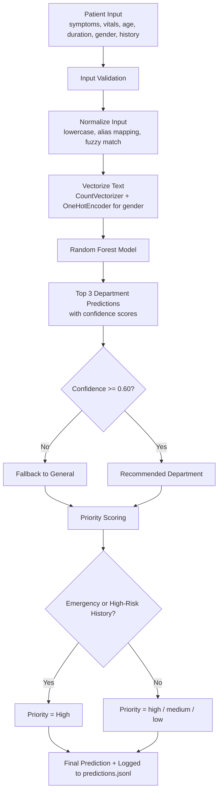
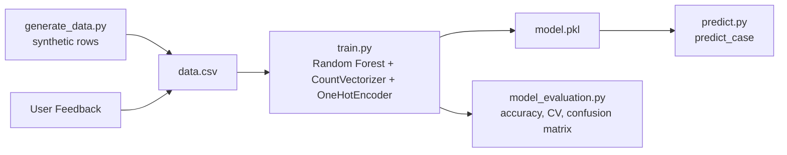
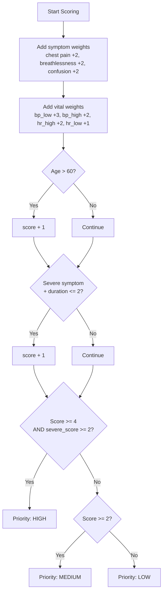
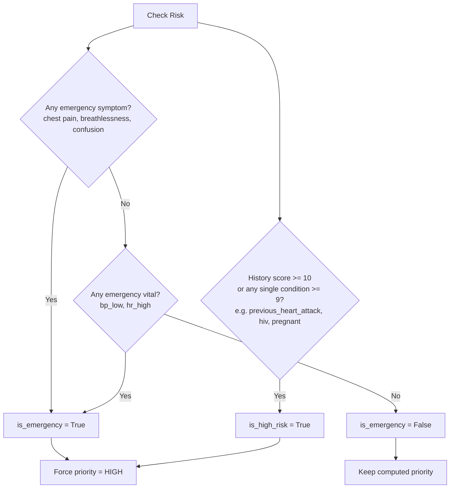
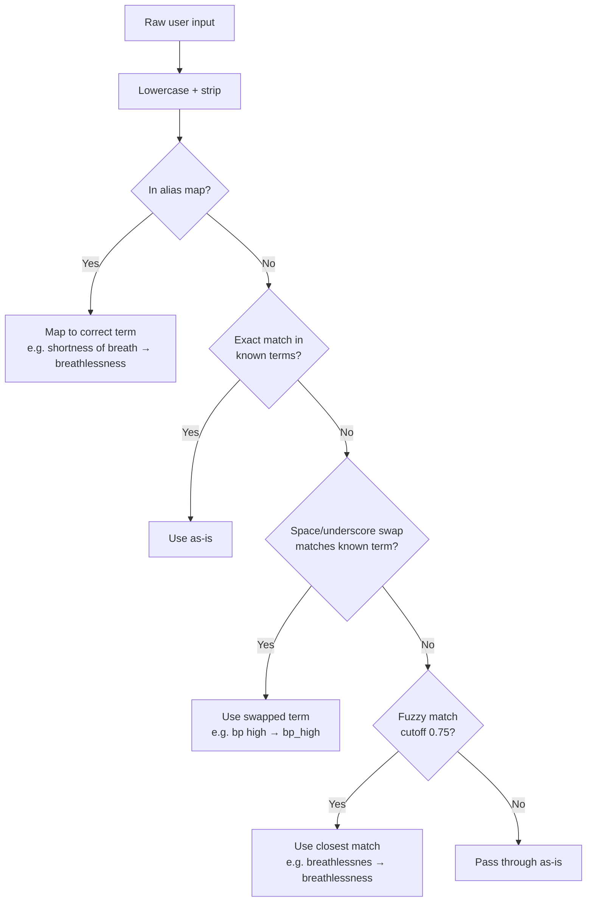
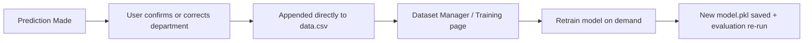

# Patient Router

> ML-based hospital triage routing system that automatically assigns patients to the most appropriate department based on symptoms, vitals, age, gender, duration, and medical history — with a full React dashboard for prediction, feedback, retraining, and monitoring.

---

## Overview

In hospital emergency departments, patients are often routed to the wrong department initially — wasting critical time. Patient Router automates this initial triage decision using a Random Forest classifier trained on structured patient data, combined with a rule-based priority and emergency-detection layer on top, and a feedback loop that feeds corrections straight back into the training set.

The project has three parts:
- **ML core** (`ml/`) — synthetic data generation, training, evaluation, and inference
- **Flask API** (`app/`, `routes/`, `services/`) — exposes the ML pipeline over HTTP
- **React dashboard** (`frontend/`) — patient intake form, feedback collection, dataset manager, training runner, evaluation viewer, and logs

---

## System Flow



---

## ML Pipeline



---

## Priority Scoring Logic



Note: `priority.py` requires both an overall score **and** a minimum "severe" symptom/vital contribution to reach HIGH — this is stricter than the simplified scoring used to label synthetic training data in `generate_data.py`.

---

## Emergency & History Risk Detection



---

## Input Normalization Flow



---

## Feedback Loop



Feedback is appended straight into the same `data.csv` used for training (not a separate file) — a row with the corrected department becomes part of the next training run as soon as `/train` is called.

---

## Project Structure

```
patient-router/
├── backend/
│   ├── app.py                      # Flask app entrypoint
│   ├── requirements.txt
│   ├── routes/
│   │   ├── homeRoute.py
│   │   ├── healthRoute.py
│   │   ├── predictRoute.py
│   │   ├── feedbackRoute.py
│   │   ├── dataRoute.py
│   │   ├── trainRoute.py
│   │   ├── evaluationRoute.py
│   │   └── logRoute.py
│   ├── services/
│   │   ├── predictService.py
│   │   ├── feedbackService.py
│   │   ├── dataService.py
│   │   ├── trainService.py
│   │   ├── evalutationService.py
│   │   └── logService.py
│   ├── ml/
│   │   ├── constants.py            # symptom/vital weights, departments, aliases
│   │   ├── generate_data.py        # synthetic dataset generation
│   │   ├── train.py                # model training
│   │   ├── model_evaluation.py     # accuracy, CV, confusion matrix
│   │   ├── prediction/
│   │   │   ├── predict.py          # inference entrypoint (predict_case)
│   │   │   ├── priority.py         # priority scoring
│   │   │   ├── emergency.py        # emergency detection
│   │   │   └── history.py          # medical history risk scoring
│   │   └── models/
│   │       └── model.pkl
│   ├── data/
│   │   └── data.csv                # synthetic + feedback training data
│   ├── logs/
│   │   ├── predictions.jsonl
│   │   └── triage.log
│   └── reports/
│       ├── evaluation_metrics.json
│       ├── evaluation_report.txt
│       ├── confusion_matrix.png
│       └── evaluation_report.png
├── frontend/
│   ├── index.html
│   ├── package.json
│   ├── vite.config.ts
│   ├── vercel.json
│   ├── public/
│   │   ├── favicon.svg
│   │   └── icons.svg
│   └── src/
│       ├── App.tsx
│       ├── main.tsx
│       ├── api/
│       │   └── api.ts
│       ├── components/
│       │   ├── layout/
│       │   │   ├── Sidebar.tsx
│       │   │   ├── Topbar.tsx
│       │   │   └── TagInput.tsx
│       │   └── patient-router/
│       │       └── patientForm.tsx
│       ├── pages/
│       │   ├── PatientRouter.tsx   # intake form + prediction + feedback
│       │   ├── DataManger.tsx      # dataset stats + generation
│       │   ├── Training.tsx        # trigger retraining, view accuracy
│       │   ├── Evaluation.tsx      # metrics, confusion matrix, report
│       │   └── Logs.tsx            # prediction history + stats
│       ├── hooks/
│       │   ├── usePatientRouter.ts
│       │   ├── useDataManager.ts
│       │   ├── useTraining.ts
│       │   ├── useEvaluation.ts
│       │   └── useLogs.ts
│       ├── types/
│       │   ├── prediction.ts
│       │   ├── dataTypes.ts
│       │   ├── trainingTypes.ts
│       │   ├── evaluationType.ts
│       │   ├── logsTypes.ts
│       │   └── patientFromTypes.ts
│       └── constants/
│           └── patientOptions.ts   # symptom/vital/history/department options
├── docs/
│   ├── api.md
│   ├── architecture.md
│   └── assets/screenshots/home.png
├── LICENSE
└── README.md
```

---

## Dataset

Generated synthetically using `generate_data.py`, with configurable size (default `SAMPLE_SIZE` in `constants.py`).

| Property | Detail |
|---|---|
| Departments | 6 (cardiology, pulmonology, neurology, orthopedics, gastrology, general) |
| Distribution | Evenly split across departments, then shuffled |
| Symptoms | 20, grouped by department with cross-department overlap noise |
| Vitals | bp_high, bp_low, hr_high, hr_low, temp_high, temp_low, normal |
| History | pregnant, previous_heart_attack, on_blood_thinners, hiv, diabetes, hypertension |

**Noise applied during generation:**

| Noise Type | Probability |
|---|---|
| Cross-department symptom added | 40% |
| Symptom dropout (drop one if >1) | 20% |
| Vital measurement flipped to opposite | 15% |
| Extra unrelated vital added | 30% |
| Vitals reported as "normal" only | 10% |
| Unrelated history condition added | 15% (if history non-empty) |
| History condition dropped | 10% (if >1 present) |
| History cleared entirely | 20% |

---

## API

### Core
| Method | Route | Description |
|---|---|---|
| `GET` | `/` | Service info |
| `GET` | `/health` | Health check |

### Prediction & Feedback
| Method | Route | Description |
|---|---|---|
| `POST` | `/predict` | Run triage prediction |
| `POST` | `/feedback` | Submit correction, appended to `data.csv` |

### Dataset
| Method | Route | Description |
|---|---|---|
| `GET` | `/data` | Dataset stats (row/column counts, department & priority distribution) |
| `POST` | `/data/generate` | Regenerate synthetic dataset (`{ "rows": 50000 }`) |

### Training & Evaluation
| Method | Route | Description |
|---|---|---|
| `POST` | `/train` | Retrain the model on current `data.csv` |
| `GET` | `/evaluation` | Evaluation metrics JSON |
| `GET` | `/evaluation/confusion-matrix` | Confusion matrix image |
| `GET` | `/evaluation/report-image` | Evaluation report image |

### Logs
| Method | Route | Description |
|---|---|---|
| `GET` | `/logs` | Prediction history + emergency/fallback counts |
| `POST` | `/logs/clear` | Clear prediction log |

### `POST /predict`

**Request:**
```json
{
  "symptoms": "chest pain, breathlessness",
  "vitals": "bp_high, hr_high",
  "age": 65,
  "duration": 2,
  "gender": "male",
  "history": "previous_heart_attack"
}
```

**Response:**
```json
{
  "recommended": "cardiology",
  "departments": [
    { "department": "cardiology", "confidence": 0.97 },
    { "department": "pulmonology", "confidence": 0.02 },
    { "department": "general", "confidence": 0.01 }
  ],
  "priority": "high",
  "emergency": true,
  "confidence": 0.97,
  "reasons": ["chest pain", "breathlessness", "bp_high", "hr_high", "History: previous_heart_attack", "Age risk (65 years)", "Acute onset (2 days)"],
  "history": ["previous_heart_attack"],
  "history_score": 10,
  "model_version": "1.1.0",
  "warning": null
}
```

---

## Running Locally

### Backend

```bash
cd backend
python -m venv venv
source venv/bin/activate
pip install -r requirements.txt

# generate dataset
python -m ml.generate_data

# train model + run evaluation
python -m ml.train

# start API
python app.py
```

### Frontend

```bash
cd frontend
npm install
echo "VITE_BACKEND=http://localhost:5000" > .env
npm run dev
```

---

## Limitations

- Trained on synthetic data — real-world accuracy would be lower and would need clinical validation
- Small vocabulary of 20 symptoms, 7 vitals, and 6 history conditions
- CountVectorizer treats multi-word symptoms as separate tokens
- Only 6 departments — real hospitals have many more, with finer sub-specialties
- The synthetic data labeling logic (`generate_data.py`) and the live priority logic (`priority.py`) aren't perfectly aligned, which can introduce label/inference drift
- Feedback corrections are written straight into the training CSV with minimal validation — bad input could degrade future retraining
- No authentication on training/data-regeneration endpoints

---

## Tech Stack

**Backend:** Python, Flask, scikit-learn, pandas, numpy, joblib
**Frontend:** React, TypeScript, Vite, lucide-react
**ML:** RandomForestClassifier, CountVectorizer, OneHotEncoder
