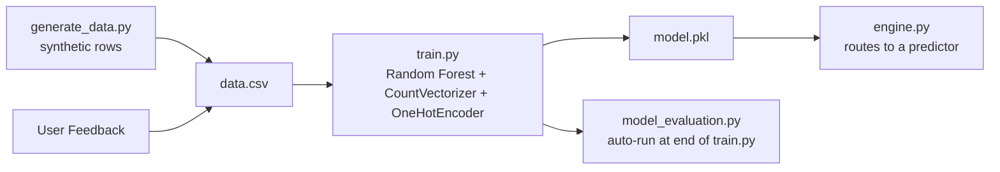
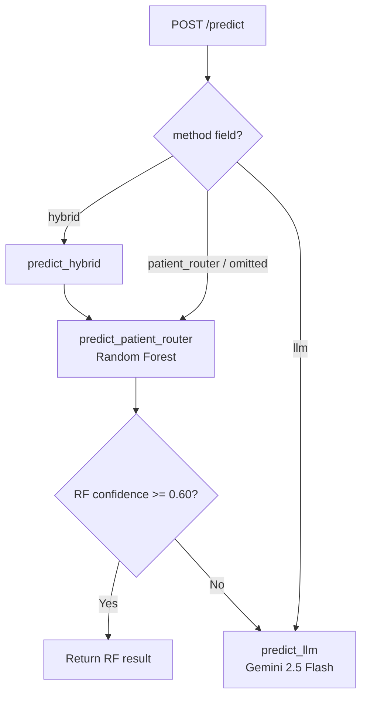
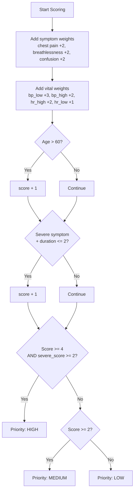
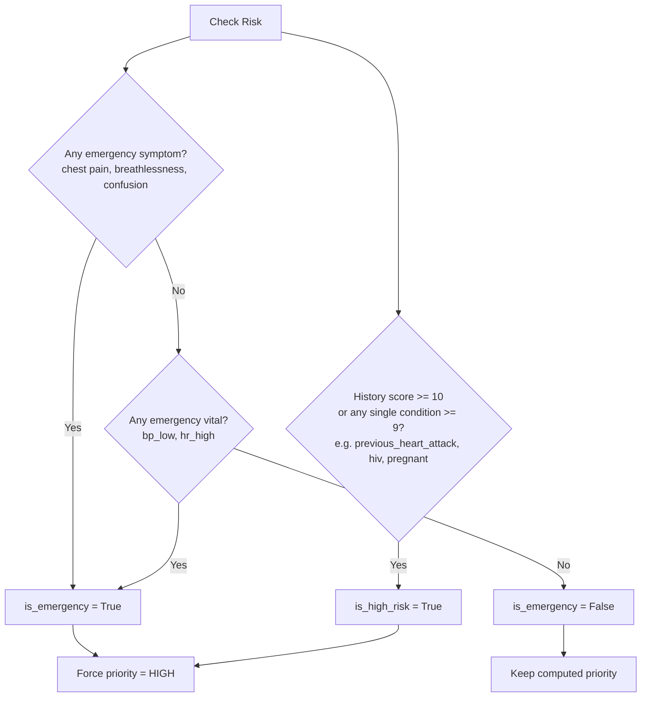
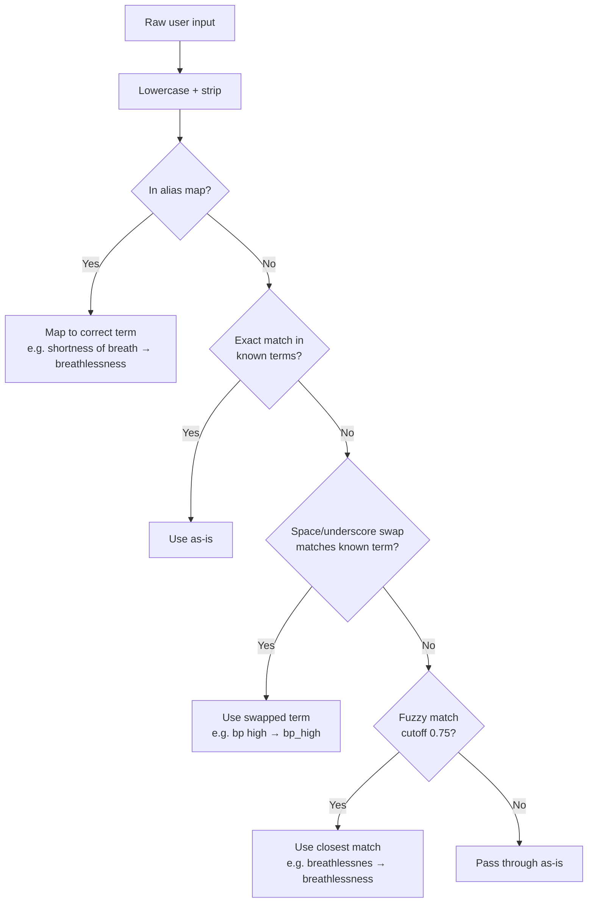
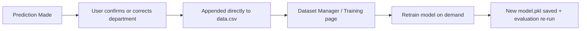

# Architecture

Internals referenced from the main [README](../README.md): the ML training pipeline, the three prediction methods, priority scoring, emergency detection, input normalization, model evaluation, and the feedback loop. For setup instructions or the API contract, see [README.md](../README.md), [setup.md](setup.md), and [api.md](api.md).

---

## ML Pipeline

How the Random Forest model is built, from synthetic data to a trained artifact.



`train.py` calls `model_evaluation.evaluate()` automatically once training finishes. Evaluation is not a separate manual step; it runs after every `/train` call. See [Model Evaluation](#model-evaluation).

### Dataset

Generated synthetically by `generate_data.py`, with configurable size (`SAMPLE_SIZE` in `constants.py`, default `50000`).

| Property | Detail |
|---|---|
| Departments | 6 (cardiology, pulmonology, neurology, orthopedics, gastrology, general) |
| Distribution | Evenly split across departments, then shuffled |
| Symptoms | 20, grouped by department with cross-department overlap noise |
| Vitals | bp_high, bp_low, hr_high, hr_low, temp_high, temp_low, normal |
| History | pregnant, previous_heart_attack, on_blood_thinners, hiv, diabetes, hypertension |

**Noise applied during generation**, to keep the synthetic data from being trivially separable:

| Noise Type | Probability |
|---|---|
| Cross-department symptom added | 40% |
| Symptom dropout (drop one if >1) | 20% |
| Vital measurement flipped to opposite | 15% |
| Extra unrelated vital added | 30% |
| Vitals reported as "normal" only | 10% |
| Unrelated history condition added | 15% (if history non-empty) |
| History condition dropped | 10% (if >1 present) |
| History cleared entirely | 20% |

---

## Prediction Methods

`backend/ml/engine.py` is the inference entrypoint. It dispatches to one of three predictors:

```python
PREDICTORS = {
    "patient_router": predict_patient_router,
    "llm": predict_llm,
    "hybrid": predict_hybrid,
}
```

The method defaults to `"patient_router"` and can be overridden per-request via a `method` field in the request payload (`data.get("method", method)`).



### `patient_router` — Random Forest

Input normalization → CountVectorizer/OneHotEncoder → RandomForestClassifier → top-3 department confidences → priority scoring → rule-based emergency detection. Detail in the sections below.

### `llm` — Gemini 2.5 Flash

`ml/predictors/llm.py` sends patient data directly to `gemini-2.5-flash` with a prompt constraining it to the same 6 departments, requesting a JSON object: `recommended`, `confidence_level` (`low`/`medium`/`high`), `priority`, `emergency` (boolean), and `clinical_reasoning` (list of strings).

`confidence_level` is mapped to a fixed numeric confidence via `CONFIDENCE_LEVEL_MAP` (`low=0.4, medium=0.65, high=0.85`), rather than using a raw probability from the model, since an LLM's self-reported confidence isn't treated as calibrated.

Two behaviors differ from the `patient_router` path:

- **No input normalization.** Raw symptom/vital text is passed directly into the prompt — no alias mapping, no fuzzy matching against the known vocabulary (see [Input Normalization Flow](#input-normalization-flow)). The two predictors do not operate on identically-cleaned input.
- **No rule-based emergency detection.** `emergency.py`'s `detect_emergency()` is not called on this path. The `emergency` flag is Gemini's self-reported value. History-based risk (`analyze_history`) is applied identically to both paths and can still force `priority` to `"high"`.

Predictions are logged to the same `predictions.jsonl` as the RF path, tagged `"model": "gemini-2.5-flash"` instead of `"model": "patient-router-{MODEL_VERSION}"`.

### `hybrid` — Random Forest with LLM fallback

`ml/predictors/hybrid.py` runs `predict_patient_router`, then calls `predict_llm` only if the RF's top-department confidence is below `CONFIDENCE_THRESHOLD` (0.60) — the same threshold used for the RF's own general-department fallback.

When hybrid falls through to the LLM, it passes the original, unnormalized request data, not the RF path's normalized symptom/vital lists, since `predict_llm(data)` re-parses from scratch.

---

## Priority Scoring Logic

Runs after a department is chosen, in `ml/rules/priority.py`. Applies fully to the `patient_router` path. The `llm` path does not call this function; Gemini self-reports its own `priority`, which is then only overridden upward — never downgraded — by the same history-risk check described below.



**Known discrepancy:** `priority.py` requires both an overall score and a minimum "severe" symptom/vital contribution to reach HIGH. `generate_data.py`'s `compute_priority()`, used to label synthetic training data, only checks the overall score and has no separate severe-score gate. This mismatch is a source of label/inference drift for the `patient_router` predictor. See [Limitations](../README.md#limitations).

---

## Emergency & History Risk Detection

Runs in parallel with priority scoring, in `ml/rules/emergency.py` and `ml/rules/history.py`. Either can force priority to HIGH regardless of the score above. `emergency.py` is invoked only by the `patient_router` predictor (see [Prediction Methods](#prediction-methods)). `history.py`'s `analyze_history()` is shared by both predictors.



---

## Input Normalization Flow

Before symptoms/vitals reach the vectorizer, free-text input is normalized against the known vocabulary in `ml/predictors/patient_router.py`. This step runs only for the `patient_router` predictor; the `llm` predictor sends raw text directly to Gemini, unnormalized (see [Prediction Methods](#prediction-methods)).



**Scope:** `frontend/src/components/layout/TagInput.tsx` restricts dashboard input to a dropdown of exact matches against `constants/patientOptions.ts`, which mirrors `KNOWN_SYMPTOMS`/`KNOWN_VITALS`/`KNOWN_HISTORY` exactly. There is no way to submit arbitrary free text through that component, so dashboard requests already arrive pre-normalized and this logic has nothing to correct in that path. It applies to `/predict` as a public API: a direct caller (curl, a third-party integration) can send free text such as `"sob"` or `"bp high"`, and this is the logic that normalizes it.

---

## Model Evaluation

`ml/model_evaluation.py` runs automatically at the end of every `train.py` run. It performs two separate evaluations:

1. **Synthetic held-out test set** — a standard 80/20 split of `data.csv`, plus 5-fold cross-validation. Reports overall accuracy, per-fold CV scores, a classification report, and per-department accuracy/average-confidence.
2. **Hand-crafted "real-world" edge cases** — 32 manually written patient cases (`REAL_WORLD_CASES`) covering single-symptom presentations, elderly/young-patient edge cases, cross-department symptom overlap (e.g. "breathlessness" appearing in both cardiology and pulmonology profiles), and cases where vitals contradict symptoms. These are harder than the evenly-distributed synthetic data and closer to real intake data.

The difference between the two accuracy numbers (synthetic accuracy − edge-case accuracy) is reported as a **generalization gap**. Guidance encoded in the script: a gap over 20 points indicates normalization work is needed, 10–20 indicates alias/fuzzy-match expansion would help, and under 10 is considered reasonable generalization.

Output artifacts (saved under `backend/reports/`):

| File | Contents |
|---|---|
| `evaluation_report.png` | 6-panel chart: both confusion matrices, synthetic-vs-edge-case accuracy bar, per-department accuracy, per-department confidence, CV fold stability |
| `evaluation_report.txt` | Plain-text summary: both accuracies, generalization gap, per-department breakdown, classification report |
| `evaluation_metrics.json` | Machine-readable: synthetic accuracy, CV mean/std, edge-case accuracy, generalization gap, edge-case pass/fail counts |

This evaluation applies only to the `patient_router` (Random Forest) model. The `llm` and `hybrid` predictors are not covered — there is no equivalent held-out set or generalization-gap concept defined for a prompted model.

---

## Feedback Loop

How a correction made in the dashboard makes it back into the model.



Feedback is appended directly into the same `data.csv` used for training. A row with the corrected department becomes part of the next training run once `/train` is called, which in turn triggers the full evaluation described above. There is no validation on these rows beyond what the API layer enforces (see [Limitations](../README.md#limitations)). This loop feeds only the `patient_router` model; it has no effect on the `llm` predictor, which is not trained on local data.