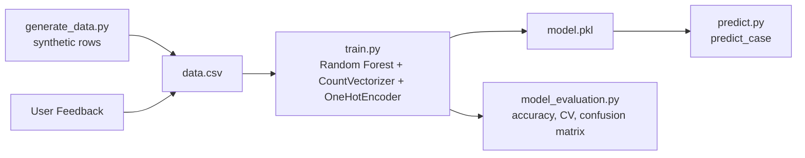
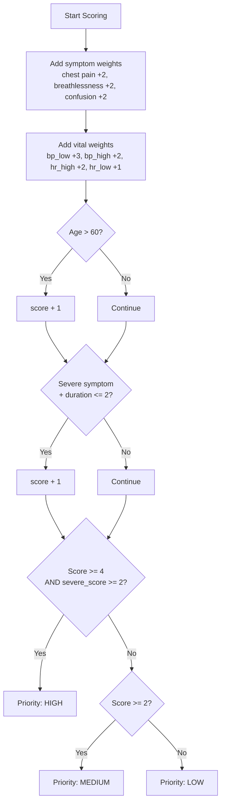
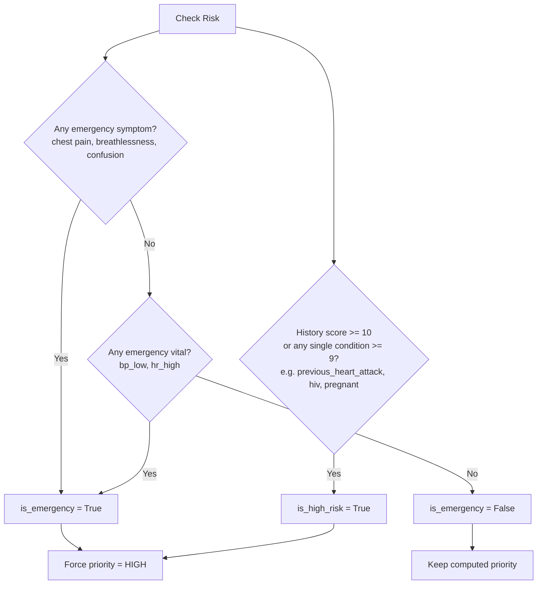
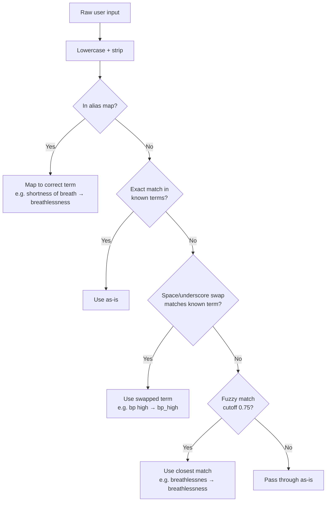
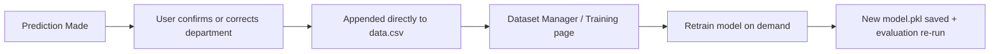

# Architecture

This document covers the internals referenced from the main [README](../README.md): the ML training pipeline, priority scoring, emergency detection, input normalization, and the feedback loop. If you're looking for setup instructions or the API contract, see [README.md](../README.md) and [api.md](api.md) instead.

---

## ML Pipeline

How the model itself gets built, from synthetic data to a trained artifact.

### Dataset

Generated synthetically using `generate_data.py`, with configurable size (default `SAMPLE_SIZE` in `constants.py`).

| Property | Detail |
|---|---|
| Departments | 6 (cardiology, pulmonology, neurology, orthopedics, gastrology, general) |
| Distribution | Evenly split across departments, then shuffled |
| Symptoms | 20, grouped by department with cross-department overlap noise |
| Vitals | bp_high, bp_low, hr_high, hr_low, temp_high, temp_low, normal |
| History | pregnant, previous_heart_attack, on_blood_thinners, hiv, diabetes, hypertension |

**Noise applied during generation** (this is what keeps the synthetic data from being trivially separable):

| Noise Type | Probability |
|---|---|
| Cross-department symptom added | 40% |
| Symptom dropout (drop one if >1) | 20% |
| Vital measurement flipped to opposite | 15% |
| Extra unrelated vital added | 30% |
| Vitals reported as "normal" only | 10% |
| Unrelated history condition added | 15% (if history non-empty) |
| History condition dropped | 10% (if >1 present) |
| History cleared entirely | 20% |

---

## Priority Scoring Logic

Runs after a department is chosen, in `priority.py`.

> **Note:** `priority.py` requires both an overall score **and** a minimum "severe" symptom/vital contribution to reach HIGH — this is stricter than the simplified scoring used to label synthetic training data in `generate_data.py`. This mismatch is a known source of label/inference drift (see [Limitations](../README.md#limitations)).

---

## Emergency & History Risk Detection

Runs in parallel with priority scoring, in `emergency.py` and `history.py`. Either one can force priority to HIGH regardless of the score above.

---

## Input Normalization Flow

Before symptoms/vitals reach the vectorizer, free-text input is normalized against the known vocabulary.

---

## Feedback Loop

How a correction made in the dashboard makes it back into the model.

Feedback is appended straight into the same `data.csv` used for training (not a separate file) — a row with the corrected department becomes part of the next training run as soon as `/train` is called. There's currently no validation on these rows beyond what the API layer enforces (see [Limitations](../README.md#limitations)).