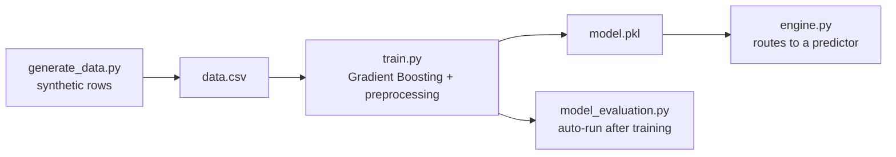
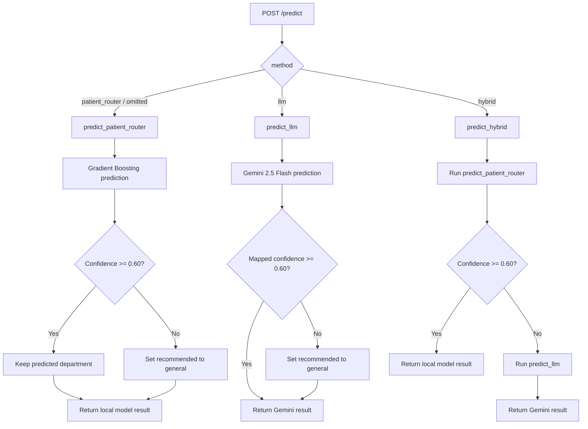
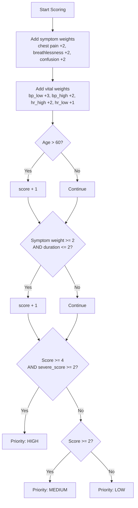
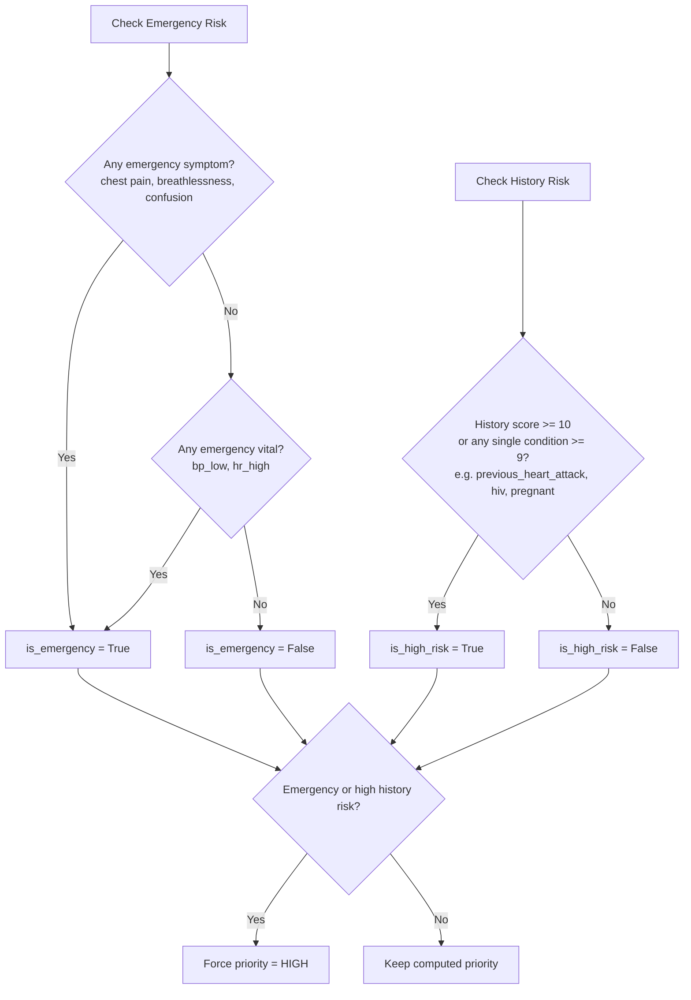
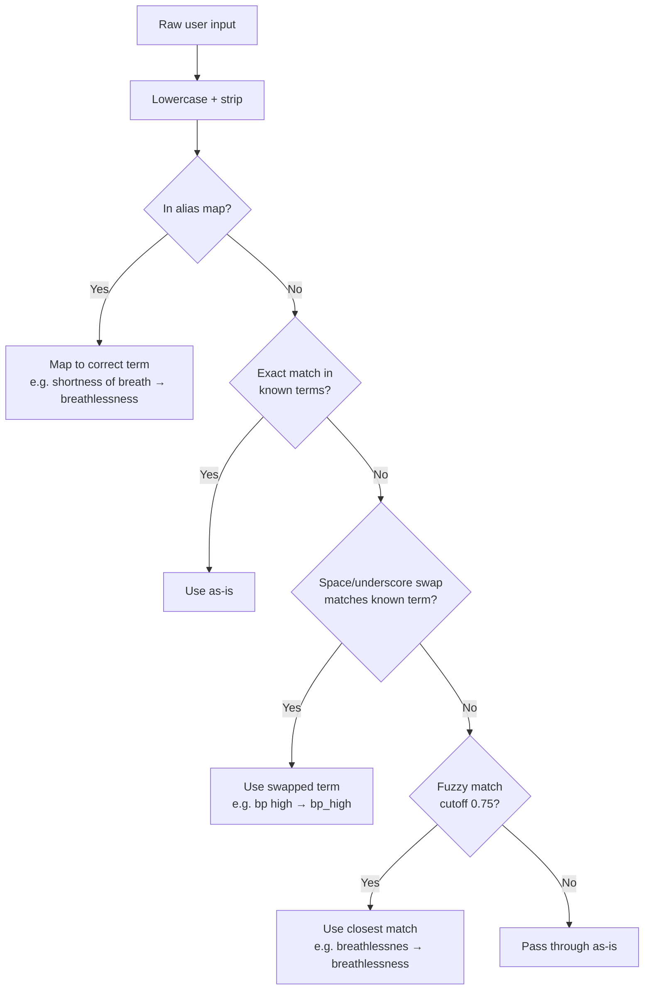
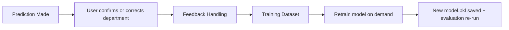

# Architecture

Internals referenced from the main [README](../README.md): the ML training pipeline, the three prediction methods, priority scoring, emergency detection, input normalization, model evaluation, model comparison, and the feedback loop. For setup instructions or the API contract, see [README.md](../README.md), [setup.md](setup.md), and [api.md](api.md).

---

## ML Pipeline

How the Gradient Boosting model is built, from synthetic data to a trained artifact.



`train.py` combines symptoms, vitals, and history into one text field. `CountVectorizer` processes this text, while age and duration are passed directly and gender is one-hot encoded. The final pipeline uses `GradientBoostingClassifier` and is saved as `model.pkl`.

Missing history values are filled with an empty string. Rows with missing department, symptoms, vitals, age, duration, or gender are dropped before training.

`train.py` calls `model_evaluation.evaluate()` automatically once training finishes. Model comparison is separate and has to be run manually. See [Model Evaluation](#model-evaluation) and [Model Comparison](#model-comparison).

### Dataset

Generated synthetically by `generate_data.py`, with configurable size (`SAMPLE_SIZE` in `constants.py`, default `50000`).

| Property     | Detail                                                                          |
| ------------ | ------------------------------------------------------------------------------- |
| Departments  | 6 (cardiology, pulmonology, neurology, orthopedics, gastrology, general)        |
| Distribution | Evenly split across departments, then shuffled                                  |
| Symptoms     | 20, grouped by department with cross-department overlap noise                   |
| Vitals       | bp_high, bp_low, hr_high, hr_low, temp_high, temp_low, normal                   |
| History      | pregnant, previous_heart_attack, on_blood_thinners, hiv, diabetes, hypertension |

**Noise applied during generation**, to keep the synthetic data from being trivially separable:

| Noise Type                            | Probability                |
| ------------------------------------- | -------------------------- |
| Cross-department symptom added        | 40%                        |
| Symptom dropout (drop one if >1)      | 20%                        |
| Vital measurement flipped to opposite | 15%                        |
| Extra unrelated vital added           | 30%                        |
| Vitals reported as "normal" only      | 10%                        |
| Unrelated history condition added     | 15% (if history non-empty) |
| History condition dropped             | 10% (if >1 present)        |
| History cleared entirely              | 20%                        |

---

## Prediction Methods

`backend/ml/engine.py` is the inference entrypoint. It dispatches to one of three predictors:

```python
PREDICTORS = {
    "patient_router": predict_patient_router,
    "llm": predict_llm,
    "hybrid": predict_hybrid,
}
```

The method defaults to `"patient_router"` and can be changed per request using the `method` field.



### `patient_router` - Gradient Boosting

Input normalization → preprocessing pipeline → `GradientBoostingClassifier` → top-three department predictions → priority scoring → emergency detection.

Symptoms, vitals, and history are combined into the text passed to the model. Age and duration are passed directly, while gender is one-hot encoded.

The predictor returns the three departments with the highest confidence scores. If the top confidence is below `CONFIDENCE_THRESHOLD` (`0.60`), the recommended department falls back to `general`.

Only `recommended` is changed by this fallback. The original top-three predictions and top confidence are still returned, and a fallback reason is added.

### `llm` - Gemini 2.5 Flash

`ml/predictors/llm.py` sends the patient data to `gemini-2.5-flash` with a prompt that restricts the result to the same 6 departments.

Gemini is asked to return `recommended`, `confidence_level`, `priority`, `emergency`, and `clinical_reasoning`.

`confidence_level` is converted to a fixed numeric confidence using `CONFIDENCE_LEVEL_MAP`:

| Level  | Confidence |
| ------ | ---------- |
| low    | 0.40       |
| medium | 0.65       |
| high   | 0.85       |

I used fixed values here because the LLM's self-reported confidence is not treated as a calibrated model probability.

Two parts of this path are different from `patient_router`:

* **No input normalization.** Raw symptom and vital text is sent directly to Gemini. Alias mapping and fuzzy matching are not used.
* **No rule-based emergency detection.** The `emergency` value comes from Gemini. History risk is still checked locally and can force priority to `high`.

A third difference is the confidence-threshold fallback. The mapped confidence is checked against the same `CONFIDENCE_THRESHOLD` (`0.60`) used by `patient_router`. Since `CONFIDENCE_LEVEL_MAP` only produces `0.40`, `0.65`, or `0.85`, this fallback fires whenever Gemini reports `confidence_level: "low"`. When it fires, `recommended` is overwritten to `general`, and because the single `departments` entry for this path is built from `recommended`, it reflects `general` too instead of Gemini's original pick. This is different from `patient_router`, which keeps its original top-three predictions even after falling back.

If Gemini returns an unknown department, the recommendation falls back to `general`.

Predictions are written to the same `predictions.jsonl` file as local model predictions, with `"model": "gemini-2.5-flash"`.

### `hybrid` - Local model with LLM fallback

`ml/predictors/hybrid.py` first runs `predict_patient_router`.

If the local model confidence is at least `0.60`, its result is returned. If confidence is lower, the original request data is passed to `predict_llm`.

The LLM gets the original input, not the normalized symptoms and vitals from the local model path.

One side effect of the current implementation is that a low-confidence hybrid request creates two prediction log entries. The local prediction is logged first, then the Gemini result is logged when the fallback runs.

---

## Priority Scoring Logic

Priority scoring is handled by `ml/rules/priority.py` for the `patient_router` path. The `llm` path uses Gemini's priority result, which can still be changed to `high` by the history-risk check.



**Known discrepancy:** `priority.py` and `generate_data.py` do not calculate priority in exactly the same way.

During prediction, the acute-duration point is added only when at least one symptom has a weight of 2 or more. HIGH priority also requires a `severe_score` of at least 2.

During synthetic data generation, the acute-duration point is added when any generated symptom exists in `SYMPTOMS_WEIGHT`, and HIGH priority only checks whether the total score is at least 4.

This means the priority labels in the synthetic dataset and the rules used during prediction are not completely identical.

---

## Emergency & History Risk Detection

Emergency and history risk checks are handled by `ml/rules/emergency.py` and `ml/rules/history.py`.

Either check can force priority to HIGH. Emergency detection is only used by `patient_router`, while history risk is checked by both `patient_router` and `llm`.



---

## Input Normalization Flow

Before symptoms and vitals reach the local model, they are normalized against the known vocabulary in `ml/predictors/patient_router.py`.

This only runs for `patient_router`. The `llm` predictor sends raw text directly to Gemini.



History does not use the same normalization flow. History values are split by commas, converted to lowercase, and spaces are replaced with underscores.

Unknown symptom and vital terms that cannot be normalized are passed through unchanged. If they are not part of the vocabulary learned by `CountVectorizer`, they may not add useful features to the local model.

**Scope:** `frontend/src/components/layout/TagInput.tsx` only accepts values from the frontend option lists. The current options match the backend symptom, vital, and history lists, so dashboard requests already use the configured values.

The normalization flow is mainly useful for direct `/predict` API requests, where callers can send text such as `"sob"` or `"bp high"`.

---

## Model Evaluation

`ml/model_evaluation.py` runs automatically after training. It performs two evaluations:

1. **Synthetic held-out test set:** an 80/20 stratified split of `data.csv`, plus 5-fold cross-validation.
2. **Hand-written edge cases:** 34 manually written cases covering single symptoms, different age groups, overlapping symptoms, acute and chronic cases, and cases where vitals contradict symptoms.

The difference between synthetic test accuracy and edge-case accuracy is reported as the **generalisation gap**.

The script also prints simple project-defined messages based on the gap:

* above 20 percentage points: large gap
* above 10 percentage points: moderate gap
* otherwise: small gap

These are only diagnostics used by the project, not standard or clinical evaluation thresholds.

Output artifacts are saved under `backend/reports/`:

| File                      | Contents                                                                                      |
| ------------------------- | --------------------------------------------------------------------------------------------- |
| `evaluation_report.png`   | Confusion matrices, accuracy comparison, per-department results, confidence, and CV stability |
| `evaluation_report.txt`   | Accuracy, generalisation gap, per-department results, and classification report               |
| `evaluation_metrics.json` | Synthetic accuracy, CV results, edge-case accuracy, generalisation gap, and edge-case counts  |

This evaluation only covers the locally trained Gradient Boosting model. The `llm` and `hybrid` methods are not independently evaluated by this script.

Everything here is evaluated using synthetic data and hand-written edge cases, not real patient records. The results should not be treated as evidence of clinical performance.

---

## Model Comparison

I added `ml/compare_models.py` to compare the locally trained model with other classification algorithms using the same dataset and edge cases.

The models are:

* Decision Tree
* Random Forest
* Gradient Boosting
* Logistic Regression
* K-Nearest Neighbors
* SVM with RBF kernel
* XGBoost

XGBoost is skipped if the `xgboost` package is not installed.

Each model uses the same preprocessing structure, 80/20 stratified split, 5-fold cross-validation, and 34 hand-written edge cases.

The comparison measures test accuracy, Macro F1, 5-fold CV accuracy, CV standard deviation, edge-case accuracy, generalisation gap, and training time.

The current Gradient Boosting results are:

| Metric                   | Result                |
| ------------------------ | --------------------- |
| Test Accuracy            | 98.84%                |
| Macro F1                 | 98.84%                |
| 5-Fold CV Accuracy       | 99.04%                |
| CV Standard Deviation    | ±0.07%                |
| Edge-Case Accuracy       | 91.18%                |
| Generalisation Gap       | 7.7 percentage points |
| Comparison Training Time | 12.14 seconds         |

After comparing the models, I changed the locally trained model from Random Forest to Gradient Boosting.

These results only come from the synthetic dataset and 34 hand-written edge cases used in the project. They do not show how the model would perform with real patients or hospital data.

The comparison generates four files under `backend/reports/`:

| File                    | Contents                          |
| ----------------------- | --------------------------------- |
| `model_comparison.csv`  | Comparison results in CSV format  |
| `model_comparison.json` | Comparison results in JSON format |
| `model_comparison.md`   | Markdown comparison table         |
| `model_comparison.png`  | Accuracy and training-time charts |

Model comparison does not run automatically after training. It has to be run separately through `compare_models.py`.

---

## Feedback Loop

The project also has a feedback flow where prediction corrections can be added back to the dataset before retraining.



The exact feedback validation and dataset update behaviour is handled outside the ML files covered here. See [api.md](api.md) for the API contract.

The feedback flow affects the locally trained `patient_router` model. It does not train or update the Gemini model used by the `llm` predictor.