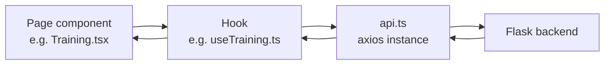

# Frontend

How the React dashboard is structured: the page → hook → API client data flow, what each dashboard page does, and the shared components underneath. For backend routes and responses, see [api.md](api.md). For the ML internals those responses come from, see [architecture.md](architecture.md).

---

## Data Flow

Most features follow the same three-layer pattern:

* **`api/api.ts`**: a shared Axios instance with its base URL from `VITE_BACKEND`, `Content-Type: application/json`, and credentials disabled. Feature hooks use this instance for backend requests.
* **Hooks** (`hooks/*.ts`): keep API calls and feature state outside the page components. Depending on the feature, they manage loading, errors, results, status, and retry behaviour.
* **Pages** (`pages/*.tsx`): combine hooks with the components and local UI state needed by each page.

`useBackendStatus.ts` separately checks backend availability through `/health`. This status is used by the application to detect when the backend is offline and provide retry behaviour.

---

## Routing & Navigation

`App.tsx` defines the dashboard routes:

| Path        | Page             | Component file      |
| ----------- | ---------------- | ------------------- |
| `/`         | Patient Router   | `PatientRouter.tsx` |
| `/training` | Model Training   | `Training.tsx`      |
| `/logs`     | System Logs      | `Logs.tsx`          |
| `/evaluate` | Model Evaluation | `Evaluation.tsx`    |
| `/data`     | Dataset Manager  | `DataManger.tsx`    |

`Sidebar.tsx` provides navigation between these pages using `react-router-dom`.

`Topbar.tsx` renders the current page title and backend connection status. Unlike the earlier static status indicator, the current application uses `useBackendStatus` to check `/health` and reflect whether the Flask backend is reachable.

---

## Patient Router (`/`)

`PatientRouter.tsx` and `usePatientRouter.ts` handle the main prediction and feedback flow.

The page includes:

1. **Prediction method selection**: the user can choose `patient_router`, `llm`, or `hybrid`. The selected value is sent as the `method` field to `/predict`. See [architecture.md](architecture.md#prediction-methods).

2. **Patient intake form**: `patientForm.tsx` collects symptoms, vitals, medical history, age, duration, and gender. Symptoms, vitals, and history use the shared `TagInput` component with values from `constants/patientOptions.ts`.

3. **Prediction result**: displays the recommended department, priority, confidence, model version, department predictions, reasons, and warnings returned by the backend.

4. **Feedback flow**: the user can mark the prediction as correct or select the correct department and submit feedback. The feedback request includes the patient data needed by `/feedback`, including medical history.

`usePatientRouter` keeps prediction state, form values, method selection, loading state, errors, and feedback handling outside the page component.

The page also uses backend status information. If the backend is unavailable, the application shows the offline state and allows the connection to be retried.

---

## Training (`/training`)

`Training.tsx` and `useTraining.ts` handle model training through `POST /train`.

The page displays:

* training status
* training accuracy
* test accuracy
* dataset size
* total training time

Training state is tracked separately for idle, training, success, and error states.

The `/train` request also runs model evaluation automatically after the Gradient Boosting model is trained. The detailed evaluation results are displayed separately on the Evaluation page. See [architecture.md](architecture.md#model-evaluation).

If the backend is unavailable or the request fails, the page displays the error and provides retry behaviour.

---

## Evaluation (`/evaluate`)

`Evaluation.tsx` and `useEvaluation.ts` display both model evaluation and model comparison results.

The evaluation data comes from `/evaluation` and includes:

* synthetic test accuracy
* 5-fold cross-validation accuracy
* CV standard deviation
* edge-case accuracy
* generalisation gap
* passed and failed edge-case counts

The page also displays `evaluation_report.png` from `/evaluation/report-image`.

Model comparison data comes from `/evaluation/comparison`. The page displays the comparison results for the available models and loads `model_comparison.png` from `/evaluation/comparison-image`.

The evaluation page does not use the old `/evaluation/confusion-matrix` image as its main report. Confusion matrices are already included in `evaluation_report.png`.

Evaluation and model comparison are separate backend workflows. Training automatically updates the evaluation report, while model comparison has to be run separately. See [architecture.md](architecture.md#model-comparison).

---

## Logs (`/logs`)

`Logs.tsx` and `useLogs.ts` load prediction history from `/logs`.

The page displays:

* total predictions
* total emergencies
* total fallbacks
* prediction log entries

Each log entry includes information such as the recommended department, priority, emergency status, confidence, and patient age.

The backend returns the complete prediction history without pagination or a server-side limit. The frontend currently renders the returned log entries directly.

`clearLogs()` sends `POST /logs/clear` and reloads the log data after the request completes.

---

## Dataset Manager (`/data`)

`DataManger.tsx` and `useDataManager.ts` handle dataset statistics and synthetic dataset generation.

The page loads the current dataset information from `/data`, including:

* total rows
* total columns
* department distribution
* priority distribution

The user can choose a row count and generate a new synthetic dataset through `/data/generate`.

After generation finishes, the dataset statistics are loaded again so the page reflects the new dataset.

Generating a dataset overwrites the current `data.csv`. It does not automatically retrain the model. Training has to be started separately from the Training page or through the API.

---

## Backend Status & Retry

`useBackendStatus.ts` checks the Flask `/health` endpoint to determine whether the backend is reachable.

This is used by the web and Electron frontend because both run the same React application.

When the backend is unavailable, the application can show an offline state instead of continuing as if the API were connected. The user can retry the connection after the backend becomes available again.

This only checks whether the Flask backend can be reached. It does not verify that the trained model, dataset, evaluation reports, or Gemini API are available.

---

## Shared Components

### `TagInput.tsx`

A searchable multi-select used for symptoms, vitals, and medical history.

Typing filters the provided options using a case-insensitive substring match and excludes values that have already been selected. Selecting an option adds it as a removable tag.

The dropdown closes when the user clicks outside the component.

The same component is used for all three fields with different option lists from `constants/patientOptions.ts`.

Only values from the provided option lists can be selected. Arbitrary free text is not submitted through this component.

Because the dashboard uses the configured vocabulary, the backend normalization and fuzzy matching flow is mainly useful for direct API requests. See [architecture.md](architecture.md#input-normalization-flow).

### `Topbar.tsx`

Displays the current page title and backend connection status.

The connection state comes from the backend health check rather than a hardcoded status.

### `Sidebar.tsx`

Provides navigation between the dashboard pages using `react-router-dom` and `lucide-react` icons.

The active page is highlighted based on the current route.

---

## Types

Request, response, and component data shapes are defined by feature under `types/`:

| File                  | Purpose                                 |
| --------------------- | --------------------------------------- |
| `prediction.ts`       | Prediction and prediction result types  |
| `trainingTypes.ts`    | Training response types                 |
| `evaluationType.ts`   | Evaluation and model comparison types   |
| `dataTypes.ts`        | Dataset statistics and generation types |
| `logsTypes.ts`        | Prediction log types                    |
| `patientFromTypes.ts` | Patient form types                      |

Keeping these types separate from the page components makes the API data structures easier to reuse between hooks and components.
