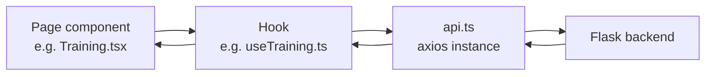

# Frontend

How the React dashboard is structured: the page → hook → API client data flow, what each dashboard page does, and the shared components underneath. For backend routes/responses, see [api.md](api.md); for the ML internals those responses come from, see [architecture.md](architecture.md).

---

## Data Flow

Every feature follows the same three-layer pattern:

- **`api/api.ts`** — a single axios instance, base URL from `VITE_BACKEND` (see [setup.md](setup.md)), `Content-Type: application/json`, no credentials. Every hook imports this same instance; none constructs its own client.
- **Hooks** (`hooks/*.ts`) — one per feature, each owning its own `loading`/`error`/`result` state and exposing the actions a page needs (e.g. `train()`, `loadEvaluation()`, `generateDataset(rows)`). Pages never call `api.ts` directly.
- **Pages** (`pages/*.tsx`) — compose a hook with presentational components, plus local UI state that doesn't need to survive a page reload (e.g. `DataManager`'s `rows` input).

**Known inconsistency:** `useTraining`, `useEvaluation`, and `useDataManager` each independently define the same inline `ApiError` shape and the same fallback chain (backend `error` field → generic `Error.message` → hardcoded string). `usePatientRouter` does the same thing inline rather than as a named type. `useLogs` does not implement this fallback at all — it only checks `e instanceof Error`, so a structured `{"error": "..."}"` from `/logs` shows a generic message instead of the backend's error text. Not yet unified into a shared error-parsing helper.

---

## Routing & Navigation

`Sidebar.tsx` defines the nav and drives active-state highlighting via `react-router-dom`'s `NavLink`:

| Path | Page | Component file |
|---|---|---|
| `/` | Patient Router (intake + prediction) | `PatientRouter.tsx` |
| `/training` | Model Training | `Training.tsx` |
| `/logs` | System Logs | `Logs.tsx` |
| `/evaluate` | Model Evaluation | `Evaluation.tsx` |
| `/data` | Dataset Manager | `DataManger.tsx` (filename as it exists in the project; note the missing "a") |

`Topbar.tsx` renders a per-page breadcrumb, title, and subtitle, plus a "Flask API Connected" status dot. The dot is hardcoded and does not ping `/health` or perform any real connection check, so it cannot reflect an actual backend outage.

---

## Patient Router (`/`)

The core triage flow. `PatientRouter.tsx` + `usePatientRouter.ts` handle:

1. **Method selection** — a `<select>` bound to `router.method` (`patient_router` / `llm` / `hybrid`), sent as the `method` field on `/predict` (see [architecture.md](architecture.md#prediction-methods)).
2. **Intake form** (`PatientForm.tsx`) — symptoms, vitals, and history are each a `TagInput` (see [Shared Components](#shared-components)) backed by the vocabulary in `constants/patientOptions.ts`; age/duration are plain number inputs; gender is a `<select>`. Client-side validation before submit mirrors the backend: at least one symptom, age in 1–120, duration > 0.
3. **Result display** — priority banner, confidence, model version, ranked department list (`router.result.departments`), clinical reasoning list, and a warning box if vitals were omitted. A collapsible `
` shows the raw JSON response, useful for comparing output across `method` values.
4. **Feedback loop** — two-step: "Yes, correct" immediately marks feedback done; "No, incorrect" reveals a department `<select>` (options from `DEPTS` in `patientOptions.ts`) and a submit button. The request payload does not include `history`. This aligns with the backend currently ignoring that field (see [api.md](api.md#post-feedback)), but the two are not linked — either could change independently.

**Known issue:** `submitFeedback` does `await api.post('/feedback', payload).catch(() => null)`. Any failure — network error, or the backend's known CSV-column bug — is swallowed, and the UI shows "✓ Feedback recorded. Thank you!" regardless of whether the save succeeded.

---

## Training (`/training`)

`Training.tsx` + `useTraining.ts` — a single button that `POST`s `/train` and displays `train_accuracy`/`test_accuracy` as progress bars, plus `dataset_size` and `training_time_insec` as stat cards. Status is tracked as an explicit state machine (`idle` → `training` → `success`/`error`) rather than a loading boolean, so the "Training in progress — feel free to navigate away" banner renders distinctly from a generic spinner.

`/train` also triggers a full evaluation run server-side (see [architecture.md](architecture.md#model-evaluation)). This page does not surface that; evaluation results are visible only on `/evaluate`.

---

## Evaluation (`/evaluate`)

`Evaluation.tsx` + `useEvaluation.ts` — fetches `/evaluation` on mount and displays the generalization-gap metrics (`synthetic_accuracy`, `cv_accuracy`, `edge_case_accuracy`, `generalization_gap`, edge-case pass/fail counts, `cv_std`).

The confusion matrix and report images are not fetched through `api.ts`/axios — they are `` tags pointing directly at the Flask backend. This is a standard pattern for binary image responses, but it means the page uses two separate data-fetching paths. Both need to be updated together if the backend URL or CORS configuration changes.

---

## Logs (`/logs`)

`Logs.tsx` + `useLogs.ts` — loads `/logs` on mount, shows total predictions/emergencies/fallbacks as stat cards, and renders every entry from the full `logs` array in a table (department, priority badge, emergency badge, confidence bar, age). The backend does not paginate or truncate this endpoint (see [api.md](api.md#get-logs)), so the table renders the entire history on every load. There is no pagination on either side; this does not scale if `predictions.jsonl` grows large.

`clearLogs()` posts to `/logs/clear` then immediately reloads, so the table empties in place without a manual refresh.

---

## Dataset Manager (`/data`)

`DataManger.tsx` + `useDataManager.ts` — a rows input and "Generate Dataset" button that calls `/data/generate`, followed automatically by a `loadStats()` call so the stats tables refresh without a separate click. Department and priority distributions are rendered as two-column tables from `Object.entries()` over the response dicts; no chart.

---

## Shared Components

### `TagInput.tsx`

A searchable multi-select used for symptoms, vitals, and history in `PatientForm`. Typing filters `options` by substring match (case-insensitive) and excludes anything already selected; selecting an item appends it as a removable pill. Closes its dropdown on outside click via a `mousedown` listener on the container ref. One generic component backs all three fields, with different `options` arrays from `constants/patientOptions.ts`.

There is no way to type and submit arbitrary free text through this component — only dropdown selections reach `onChange`, and those are always exact matches from the canonical vocabulary. As a result, the backend's alias/fuzzy-matching normalization (see [architecture.md](architecture.md#input-normalization-flow)) has nothing to do when requests originate from this dashboard; it applies only to direct API callers sending free text.

### `Topbar.tsx`

Per-page header: breadcrumb (`PatientRouter › {title}`), title, optional subtitle, and the static connection-status dot described above.

### `Sidebar.tsx`

Fixed nav using `lucide-react` icons, active-state detection via `useLocation()` combined with `NavLink`'s own `isActive` (the `/` route uses `end` matching so it does not stay highlighted on every other route).

---

## Types

Response/request shapes are defined per-feature in `types/` (`prediction.ts`, `trainingTypes.ts`, `evaluationType.ts`, `dataTypes.ts`, `logsTypes.ts`, `patientFromTypes.ts`). The field names in this document are inferred from usage (e.g. `router.result.departments`, `result.generalization_gap`), not verified directly against those type definitions.